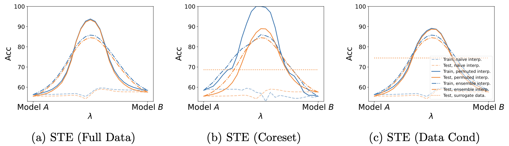

# Toward Data Efficient Model Merging between Different Datasets without Performance Degradation




code for the paper: [Toward Data Efficient Model Merging between Different Datasets without Performance Degradation](https://arxiv.org/abs/2306.05641).

Our implementation is based on this code[^1].


# Setup

```
# python 3.9.16
pip install torch==1.13.0 torchvision==0.14.0 --extra-index-url https://download.pytorch.org/whl/cu116
pip install -r requirements.txt
```


# How to use?

1. Train model.

```shell
ipython train/main_train.py  -- -c ./conf/rotated_mnist/train_mlp_rotated_mnist0.yaml
ipython train/main_train.py  -- -c ./conf/rotated_mnist/train_mlp_rotated_mnist90.yaml
```
2. Merge models (Weight Matching)

```shell
ipython matching/main_weight_matching.py -- -c ./conf/rotated_mnist/weight_match_mlp_rotated_mnist90.yaml --a_v 0 --b_v 0
```

3. Merge models (STE)

```shell
ipython matching/main_ste.py -- -c ./conf/rotated_mnist/ste_mlp_rotated_mnist_0_90.yaml --a_v 0 --b_v 0
```

4. Merge models (STE) with coreset selection

```shell
ipython matching/main_ste.py -- -c ./conf/rotated_mnist/ste_mlp_rotated_mnist_0_90_coreset_random10.yaml --a_v 0 --b_v 0
```

5. Merge models (STE) with data cond

```shell
ipython matching/main_ste.py -- -c ./conf/rotated_mnist/ste_mlp_rotated_mnist_0_90_cond10.yaml --a_v 0 --b_v 0
```

When model merging, change the versions of the models in the yaml file in the conf directory to the target of the models to be merged.

The version of the model on wandb used for model merging can also be specified with options such as `--a_v 0 --b_v 0`.

For detailed parameters of all experiments, see `./conf` directory

Our implementation manages the metrics and model checkpoints of the experiment by W&B[^2]. If you do not want to use W&B, use the `--log_wandb offline` option.

If you have a docker environment, the dockerfile is available


# Reference

[^1]: git-re-basin-pytorch https://github.com/themrzmaster/git-re-basin-pytorch
[^2]: Experiment Tracking with Weights and Biases: https://www.wandb.com/